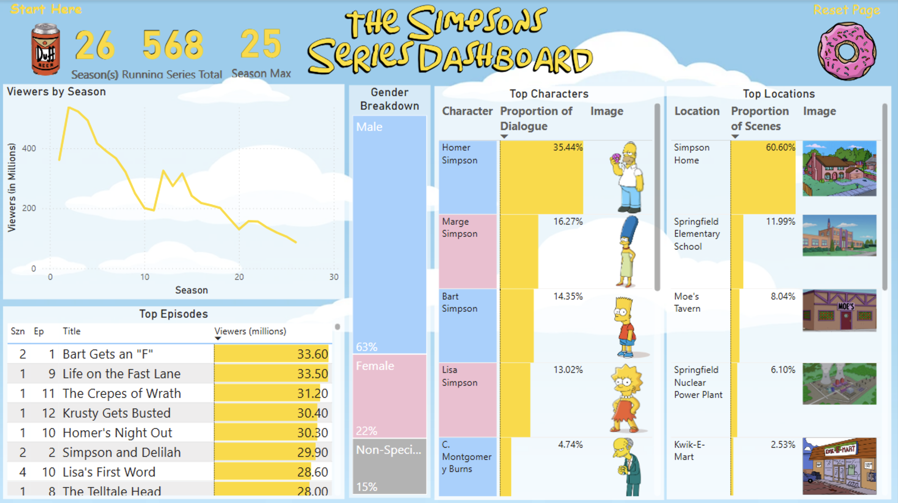

# Simpsons Series Dashboard
This interactive [Power BI report](https://app.powerbi.com/view?r=eyJrIjoiNmEwOWMzY2EtY2Q2ZS00ZjIxLWExOWMtNDFiZjA2OTVhNjg1IiwidCI6ImJjMzM5NDJjLTE2YjQtNDcwYS04Yjc5LTk1MmNmMzY0NmJjYiIsImMiOjZ9) explores The Simpsons through viewership trends, top episodes, character appearances, and iconic locations across all seasons. Users can drill into individual episodes to analyze their dialogue and see which characters and places drive each season's storylines.

Key visuals include total Viewers by Season, Top Episodes by audience, and interactive rankings of Top Characters and Top Locations. The report supports cross-filtering and drill-through—clicking on a character like Mr. Burns will filter episodes and dialogue to highlight only his contributions. Right-click any episode to Drill Through to the full script, where you can explore every line and scene breakdown.

Designed for fans and data enthusiasts alike, this dashboard invites deep exploration of a beloved cultural phenomenon—whether you're curious about which character dominated Season 10 or how viewership changed over time. All data comes courtesy of Tod Schenider and William Cukierski via [Kaggle](https://www.kaggle.com/datasets/prashant111/the-simpsons-dataset).
